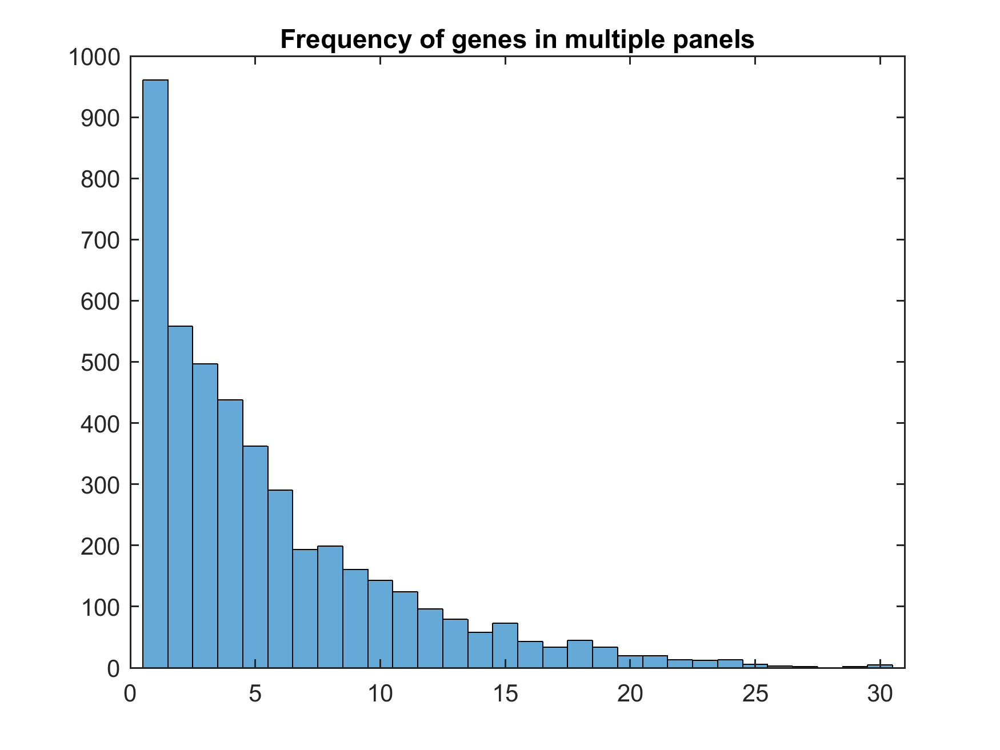
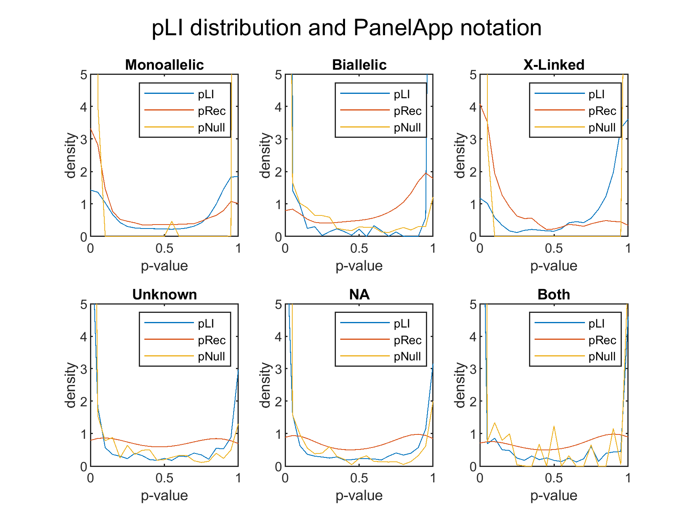

# Genomics England PanelApp analysis
An analysis of the genes in Genomics England (GEL) PanelApp.

## Summary

* number of panels: **173** (stated on web: 298)
* number of unique genes: **4487**
* number of phenotype-only genes: **26**

The genes fall under the following categories (if a gene has different modes of inheritance in different panels it is counted once each)

* Biallelic          1940 
* Both                379 
* Missing            1535 
* Mitochondrial         1 
* Monoallelic        1273 
* Other                36 
* Unknown             516 
* X-Linked            290 

These have the following ksdensity plots:

| &darr; Ex \ GEL&rarr; | Monoallelic | Biallelic | X-Linked | Other |
| --- | --- | --- | --- | --- |
| Dominant | **718** | 370 | 221 | 862 |
| None | 115 | 263 | 10 | 326 |
| Recessive | 440 | **1307** | 59 | 1279 |

I would have expected a stronger match for monoallelic... it just goes to show how specific mutation cause GoF.

## Details
Written for python3.

## PanelWrapper
Two classes within wrap the GEL PanelApp Rest API. Panel and Gene.                 

The attributes of Gene() instance are:
* gene_data
* type
* name
* confidence_level
* penetrance
* mode_of_pathogenicity
* publications
* evidence
* phenotypes
* mode_of_inheritance
* tags
* panel

Those of Panel are:
* name
* id
* disease_group
* disease_sub_group
* status
* relevant_disorders
* n_genes
* types

Both contain a class method called `.get_list(verbose=false)`, which retrieves all the entrries and returns a list of instances of Panel or Gene.
Do note that the classes inherit a base class, `_APIInterface`, that has the fetching power.

    >>> genes = Gene.get_list(verbose=True)
    >>> print(genes[0])
    {'confidence_level': '3',
     'evidence': ['Radboud University Medical Center, Nijmegen',
                  'Emory Genetics Laboratory',
                  'UKGTN',
                  'Illumina TruGenome Clinical Sequencing Services',
                  'Expert Review Green',
                  'Expert Review'],
     'gene_data': {'alias': ['HCP1', 'MGC9564', 'PCFT'],
                   'alias_name': ['heme carrier protein 1',
                                  'proton-coupled folate transporter'],
                   'biotype': 'protein_coding',
                   'ensembl_genes': {'GRch37': {'82': {'ensembl_id': 'ENSG00000076351',
                                                       'location': '17:26721661-26734215'}},
                                     'GRch38': {'90': {'ensembl_id': 'ENSG00000076351',
                                                       'location': '17:28394756-28407197'}}},
                   'gene_name': 'solute carrier family 46 member 1',
                   'gene_symbol': 'SLC46A1',
                   'hgnc_date_symbol_changed': '2007-03-29',
                   'hgnc_id': 'HGNC:30521',
                   'hgnc_release': '2017-11-03T00:00:00',
                   'hgnc_symbol': 'SLC46A1',
                   'omim_gene': ['611672']},
     'mode_of_inheritance': 'BIALLELIC, autosomal or pseudoautosomal',
     'mode_of_pathogenicity': '',
     'name': 'SLC46A1',
     'panel': {'disease_group': 'Metabolic disorders',
               'disease_sub_group': 'Specific metabolic abnormalities',
               'hash_id': '55537918bb5a161bf644a3c7',
               'id': 109,
               'name': 'Cerebral folate deficiency',
               'relevant_disorders': [],
               'stats': {'number_of_genes': 4,
                         'number_of_regions': 0,
                         'number_of_strs': 0},
               'status': 'public',
               'types': [{'description': 'Rare Disease 100K',
                          'name': 'Rare Disease 100K',
                          'slug': 'rare-disease-100k'}],
               'version': '1.2',
               'version_created': '2017-11-05T02:37:20.047324Z'},
     'penetrance': 'Complete',
     'phenotypes': ['Folate malabsorption, hereditary\t229050'],
     'publications': ['21333572', '27604308'],
     'tags': [],
     'type': 'gene'}

## Licence
The licence is the same as the GEL PanelApp. To figure what that is, look for that.

