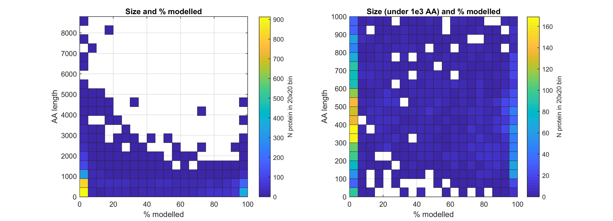

# Genomics England PanelApp analysis
An analysis of the genes in Genomics England (GEL) PanelApp.

## Code details
Written for python3.

### PanelWrapper
Two classes within wrap the GEL PanelApp Rest API. Panel and Gene.                 

The attributes of Gene() instance are:
* gene_data
* type
* name
* confidence_level
* penetrance
* mode_of_pathogenicity
* publications
* evidence
* phenotypes
* mode_of_inheritance
* tags
* panel

Those of Panel are:
* name
* id
* disease_group
* disease_sub_group
* status
* relevant_disorders
* n_genes
* types

Both contain a class method called `.get_list(verbose=false)`, which retrieves all the entrries and returns a list of instances of Panel or Gene.
Do note that the classes inherit a base class, `_APIInterface`, that has the fetching power.

    >>> genes = Gene.get_list(verbose=True)
    >>> print(genes[0])
    {'confidence_level': '3',
     'evidence': ['Radboud University Medical Center, Nijmegen',
                  'Emory Genetics Laboratory',
                  'UKGTN',
                  'Illumina TruGenome Clinical Sequencing Services',
                  'Expert Review Green',
                  'Expert Review'],
     'gene_data': {'alias': ['HCP1', 'MGC9564', 'PCFT'],
                   'alias_name': ['heme carrier protein 1',
                                  'proton-coupled folate transporter'],
                   'biotype': 'protein_coding',
                   'ensembl_genes': {'GRch37': {'82': {'ensembl_id': 'ENSG00000076351',
                                                       'location': '17:26721661-26734215'}},
                                     'GRch38': {'90': {'ensembl_id': 'ENSG00000076351',
                                                       'location': '17:28394756-28407197'}}},
                   'gene_name': 'solute carrier family 46 member 1',
                   'gene_symbol': 'SLC46A1',
                   'hgnc_date_symbol_changed': '2007-03-29',
                   'hgnc_id': 'HGNC:30521',
                   'hgnc_release': '2017-11-03T00:00:00',
                   'hgnc_symbol': 'SLC46A1',
                   'omim_gene': ['611672']},
     'mode_of_inheritance': 'BIALLELIC, autosomal or pseudoautosomal',
     'mode_of_pathogenicity': '',
     'name': 'SLC46A1',
     'panel': {'disease_group': 'Metabolic disorders',
               'disease_sub_group': 'Specific metabolic abnormalities',
               'hash_id': '55537918bb5a161bf644a3c7',
               'id': 109,
               'name': 'Cerebral folate deficiency',
               'relevant_disorders': [],
               'stats': {'number_of_genes': 4,
                         'number_of_regions': 0,
                         'number_of_strs': 0},
               'status': 'public',
               'types': [{'description': 'Rare Disease 100K',
                          'name': 'Rare Disease 100K',
                          'slug': 'rare-disease-100k'}],
               'version': '1.2',
               'version_created': '2017-11-05T02:37:20.047324Z'},
     'penetrance': 'Complete',
     'phenotypes': ['Folate malabsorption, hereditary\t229050'],
     'publications': ['21333572', '27604308'],
     'tags': [],
     'type': 'gene'}

## Results

* number of panels: **173** (stated on web: 298)
* number of unique genes: **4487**
* number of phenotype-only genes: **26**

### Inheritance mode
The genes fall under the following categories (if a gene has different modes of inheritance in different panels it is counted once each)

* Biallelic          1940 
* Both                379 
* Missing            1535 
* Mitochondrial         1 
* Monoallelic        1273 
* Other                36 
* Unknown             516 
* X-Linked            290 

These have the following ksdensity plots:

| &darr; Ex \ GEL&rarr; | Monoallelic/Dominant | Biallelic/Recessive | X-Linked | Other | Lethal | Neutral |
| --- | --- | --- | --- | --- | --- | --- |
| Predicted dominant | **718** | 370 | 221 | 862 | ? | 0? |
| Predicted recessive | 440 | **1307** | 59 | 1279 | ? | ? |
| Predicted neutral | 115 | 263 | 10 | 326 |0? | ? |

I would have expected a stronger match for monoallelic... it just goes to show how specific mutation cause GoF.     
4k is a 1/5 of the human proteome, hence the last two columns added.

### Structural models
48% of all proteins in the PanelApp have a model, either a PDB crystal structure or a Swissprot Model based on a close structure.                
20% of all proteins in the PanelApp have a model that covers over 80% of the length.

#### Confidence
As I don't like this high percentage of structurally uncharacterised yet important protein, I checked out how it distributes with confidence. Note that the 'All protein' refers to all proteins in GeneApp.

There does not seem to be a difference by eye &mdash; &chi;2 confirms (_p_ = 0.2). But what I care about are the structurally-uncharacterised confidence-level-4 protein, which are 1190 (26% total).

Submitting the list to GOrilla shows the tables [here](GO.md). As expected transporters and respiratory chain components (_e.g._ cytochrome complex) are enriched in the uncharacterised.
There are several ontologies which I think are due to membrane bending and binding, such as 'anatomical structure development' or 'cellular component organization' or 'plasma membrane bounded cell projection organization'.

In the list are also a few mannose, glycogen and glycan enzymes, which I am unsure why &mdash;membrane anchored ER enzymes?

The list is fairly interesting. A further step could be filtering out the transmembrane protein.

#### Size
Excluding TTN (titin), which is so big it messed the plots, the size is somewhat interesting.

Plotted comparing modelled and unmodelled shows that, yes, the unmodelled tend to be bigger as expected.

But who are the small ones? 127 are less than 100 AA. 261 are less than 200 AA.
GO term analysis in Gorilla against the whole protein shows that these are enriched in cytochrome activity and cellular respiration.

#### Disorder
I could check if the uncharacterised stretches are predicted to be disordered, but that is obvious and is a day-follows-night question.

#### Candidates
Which genes are ordered sub-300AA con-4 non-TM unchar genes.
Guruprasad instability > 40 used to determine stability.                 
                      
The term that stands out is mitochodrial, some iron sulfur cluster protein components and alternative splicing variants.

* not error excludes 84
* not TM excludes 1185
* <300AA excludes 2523
* without model excludes 429
* stability < 40 excludes 205
* remaining: 61

These are here full list of [candidates](candidates.md)   
Of these the ones with a level 4 confidence are:

* Protein C8orf37 &mdash; May be involved in photoreceptor outer segment disk morphogenesis (By similarity).
* Optic atrophy 3 protein &mdash; May play some role in mitochondrial processes.
* HCLS1-associated protein X-1 &mdash; Recruits the Arp2/3 complex to the cell cortex and regulates reorganization of the cortical actin cytoskeleton...
* Matrix Gla protein &mdash; Associates with the organic matrix of bone and cartilage. 
* Protein PET117 homolog, mitochondrial
* Kappa-casein  &mdash; Kappa-casein stabilizes micelle formation, preventing casein precipitation in milk.
* Protein C10
* Odontogenesis associated phosphoprotein
* Cilia- and flagella-associated protein
* Twisted gastrulation protein homolog 1
* Coiled-coil domain-containing protein
* Mitochondrial-derived peptide MOTS-c
* Cytochrome c-type heme lyase &mdash; enzyme... interesting...
* Protein PIH1D3 &mdash; Plays a role in cytoplasmic pre-assembly of axonemal dynein
* Ectodysplasin-A receptor-associated adapter protein
* Proteasome maturation protein
* Succinate dehydrogenase assembly factor 1, mitochondrial
* Ubiquinol-cytochrome-c reductase complex assembly factor 1
* Ubiquinol-cytochrome-c reductase complex assembly factor 2
* Succinate dehydrogenase assembly factor 3, mitochondrial
* Molybdopterin synthase sulfur carrier subunit
* Cytochrome c oxidase assembly factor 4 homolog, mitochondrial
* Cytochrome c oxidase assembly factor 5
* Cytochrome c oxidase assembly factor 6 homolog
* NADH dehydrogenase [ubiquinone] 1 alpha subcomplex assembly factor 8
* NADH dehydrogenase [ubiquinone] 1 alpha subcomplex assembly factor 2
* Biogenesis of lysosome-related organelles complex 1 subunit 3
* Biogenesis of lysosome-related organelles complex 1 subunit 6

Roughly half of these are subunits or assembly bits, which explains why they were not crystallised. I could submit some of them to I-Tasser, but I will stop here.

#### Size-unrestricted

## Licence
The licence is the same as the GEL PanelApp. To figure what that is, look for that.
